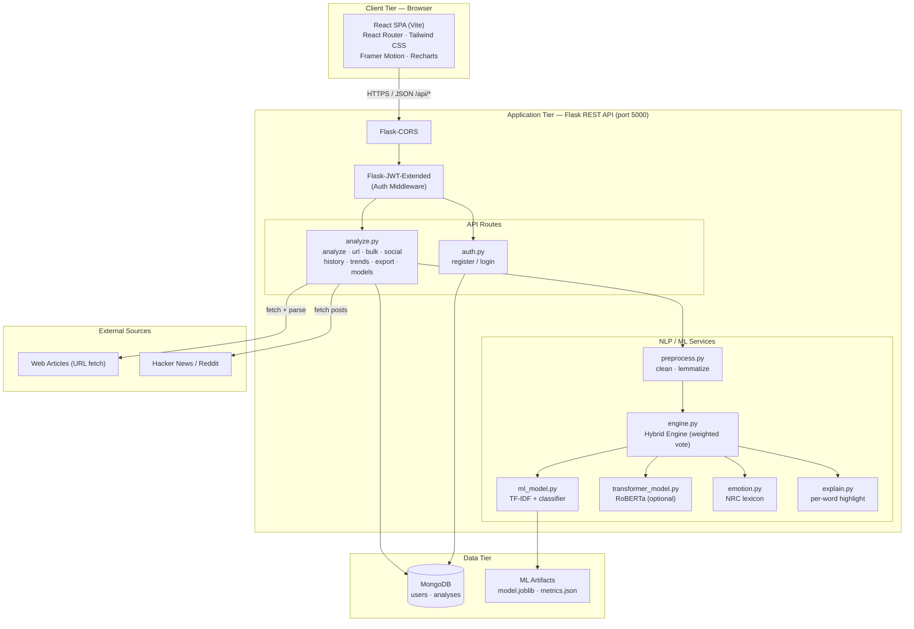
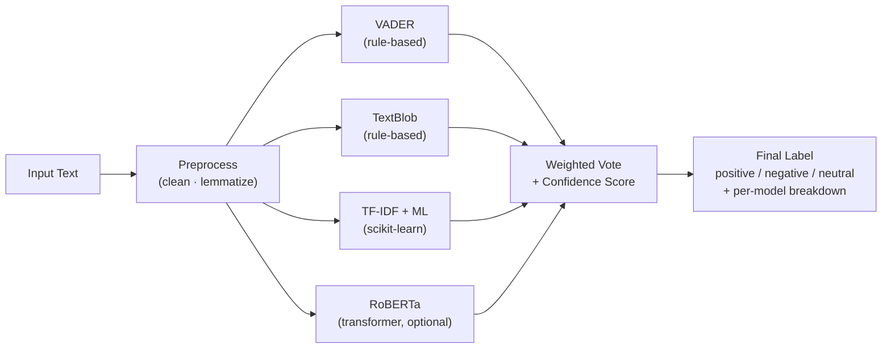
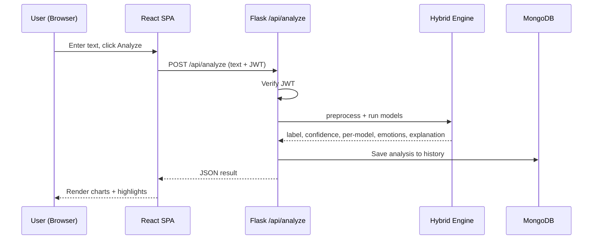
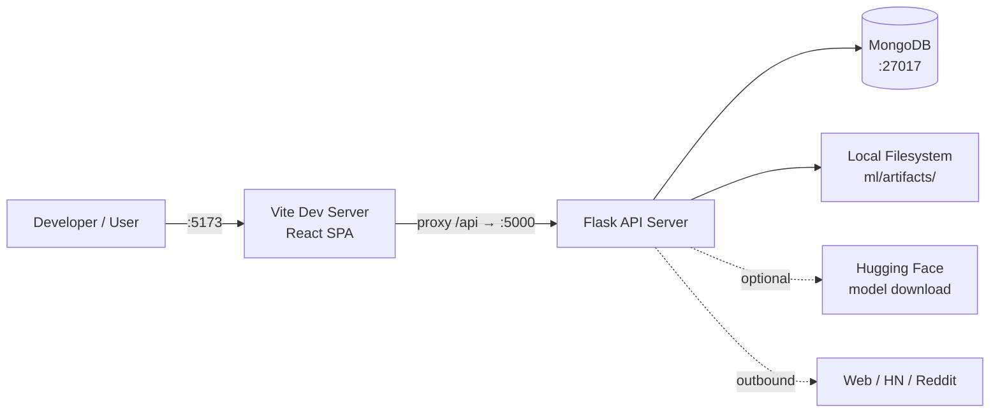

# SentiSense — System Architecture

SentiSense is a full-stack web application for **intelligent sentiment analysis**. It
combines rule-based methods (VADER, TextBlob), a classic machine-learning classifier
(TF-IDF + scikit-learn), and an optional deep-learning transformer (CardiffNLP RoBERTa)
into a single **hybrid weighted-vote engine**. This document describes the overall
system architecture, components, and data flows.

---

## 1. High-Level System Architecture

---

## 2. Component Breakdown

### Frontend (React + Vite)

| Layer | Responsibility |
| ----- | -------------- |
| `pages/` | Route screens: Login, Register, Analyze, Compare, BulkUpload, Social, Dashboard, History, Models |
| `components/` | Reusable UI + charts: SentimentCard, ConfidenceChart, EmotionChart, DistributionChart, TrendsChart, WordCloud, HighlightedText, ThemesTable |
| `context/` | `AuthContext` (JWT/session), `ThemeContext` (dark mode) |
| `api/client.js` | Axios instance; attaches JWT, proxies `/api` to backend |

### Backend (Flask)

| Module | Responsibility |
| ------ | -------------- |
| `app/__init__.py` | Flask app factory (registers CORS, JWT, routes) |
| `app/config.py` | Env-driven configuration (Mongo URI, secrets) |
| `app/models/db.py` | MongoDB connection + collection handles |
| `app/routes/auth.py` | Register / login, issues JWT |
| `app/routes/analyze.py` | Analyze, URL, bulk, social, history, trends, export, model metrics |
| `app/services/preprocess.py` | NLTK cleaning, tokenization, lemmatization |
| `app/services/engine.py` | Hybrid engine — orchestrates and weights all models |
| `app/services/ml_model.py` | Loads & predicts with the saved TF-IDF model |
| `app/services/transformer_model.py` | Optional RoBERTa transformer inference |
| `app/services/emotion.py` | Emotion detection via NRC lexicon |
| `app/services/explain.py` | Per-word sentiment highlighting / explainability |
| `ml/train.py` · `ml/evaluate.py` | Offline training + metrics generation |

---

## 3. Hybrid Sentiment Engine

The engine runs each available model, normalizes their outputs, and combines them with
configurable weights to produce a final label and a confidence score. Models that are
not installed/enabled (e.g. the transformer) are simply skipped.

---

## 4. Request Flow — Single Text Analysis

---

## 5. Technology Stack

| Layer | Technology |
| ----- | ---------- |
| Frontend | React (Vite), React Router, Tailwind CSS, Framer Motion, Recharts, Axios |
| Backend | Flask, Flask-CORS, Flask-JWT-Extended, PyMongo |
| NLP / ML | NLTK, vaderSentiment, TextBlob, scikit-learn, joblib, pandas |
| Deep Learning (optional) | Hugging Face Transformers — CardiffNLP RoBERTa (3-class) |
| Database | MongoDB |
| Export | reportlab (PDF), pandas/csv (CSV) |

---

## 6. Deployment / Runtime View

- **Frontend** runs on `http://localhost:5173` (Vite) and proxies `/api` to the backend.
- **Backend** runs on `http://localhost:5000` (Flask).
- **MongoDB** runs on `mongodb://localhost:27017` (or a MongoDB Atlas URI).
- If MongoDB is unreachable, rule-based analysis still works; auth and history require the DB.

---

## 7. API Endpoints (summary)

| Method | Endpoint | Auth | Description |
| ------ | -------- | ---- | ----------- |
| POST | `/api/auth/register` | No | Create account, returns JWT |
| POST | `/api/auth/login` | No | Log in, returns JWT |
| POST | `/api/analyze` | Yes | Analyze single text (+ emotions + explanation) |
| POST | `/api/analyze/url` | Yes | Fetch a web page and analyze its article text |
| POST | `/api/analyze/bulk` | Yes | Analyze uploaded CSV/TXT file |
| POST | `/api/social` | Yes | Fetch + analyze Hacker News / Reddit posts |
| GET | `/api/models/metrics` | Yes | Model comparison metrics + confusion matrices |
| GET | `/api/trends` | Yes | Sentiment counts aggregated by date |
| GET | `/api/history` | Yes | List the user's analyses |
| GET | `/api/export?id=&format=csv\|pdf` | Yes | Download a saved analysis report |
| GET | `/api/health` | No | Health check |
